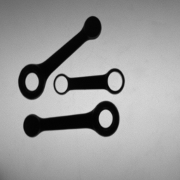
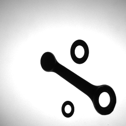
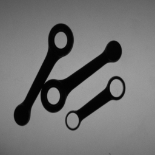
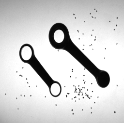

<!-- ################################################################################ 
# Antonio Morelli - 0001060348 
    ################################################################################ --> 

<!-- PROJECT LOGO -->
 

  <h1>VIMCR</h1>
  

    <h3> Visual Inspection of Motorcycle Connecting Rods </h2>      
  

<!-- TABLE OF CONTENTS -->

  
Table of Contents

  <ol>
    <li>
      <a href="#about-the-project">About The Project</a>
    </li>
    <li><a href="#requirements">Requirements</a></li>
    <li><a href="#usage">Usage</a></li>
    <li><a href="#further-developments">Further developments</a></li>    
    <li><a href="#contacts">Contacts</a></li>
  </ol>

<!-- ABOUT THE PROJECT -->
## About The Project

Students should develop a software system aimed at visual inspection of motorcycle connecting rods. The system should be able to analyse the dimensions of two different types of connecting rods to allow a vision-guided robot to pick and sort rods based on their type and dimensions. The two rod types are characterized by a different number of holes: Type A rods have one hole whilst Type B rods have two holes.

### First Task

- Image characteristics

1. Images contain only connecting rods, which can be of both types and feature significantly diverse dimensions.

2. Connecting rods have been carefully placed within the inspection area so to appear well separated in images (i.e. they do not have any contact point).

3. Images have been taken by the backlighting technique so to render rods easily distinguishable (i.e. much darker) from background. However, for flexibility reasons the system should not require any change to work properly with lighting sources of different power.

An exemplar working image is provided below:

#### Functional specifications

For each connecting rod appearing in the image, the vision system should provide the following information:

1. Type of rod (A or B).

2. Position and orientation (modulo π). 3. Length (L), Width (W), Width at the barycenter (W_b).

3. For each hole, position of the centre and diameter size.

### Second Task

While still meeting the requirement of the First Task, students should modify the system in order to deal with one (or more) of the following three changes in the characteristics of the working images:

1. Images may contain other objects (i.e. screws and washers) that need not to be analysed by the system (such kind of objects are often referred to in computer vision as "distractors").

2. Rods can have contact points but do not overlap one to another.

3. The inspection area may be dirty due to the presence of scattered iron powder.

Exemplar working images corresponding to the three changes are provide below:

Change 1.

Change 2. 

Change 3.

<!-- INSTALLATION -->
### Requirements 

- Python v. 3.7.x or later. Never tested with previous versions.
  
- While placed in the project main directory, run the command `pip install -r requirements.txt`

<!-- USAGE EXAMPLES -->
### Usage
You can either execute the nootebook contained into the folder *'notebook'* or run the application *'app.py'*. Respectively:

- Run `jupyter notebook` while placed inside *'notebook'* folder. You will get a notebook with the tasks solved sequentially.

- Run `python app.py` while placed inside *'app'* folder. An application will start, allowing to inspect single images; it is recommended to choose one folder among *'app/images/1/'*, *'app/images/2/c1'*, *'app/images/2/c2'* and *'app/images/2/c3'* and to mantain unaltered the radio buttons as the script automatically chooses the right methodology to solve the task according to folder name. 

<!-- FURTHER DEVELOPMENTS -->
### Further developments
- Add sliding bars that allow to choose parameters values (e.g., median blur kernel size, signal to noise ratio threshold, ...) before performing the analysis so that one can manually establish the correct value.

- Make an executable file for the application. 

- Use another library to develop the GUI since 'PySimpleGUI', while allowing fast development, does not seem customizable enough. 

- Fix some minor bugs that can occur in GUI application.

<!-- CONTACT -->
## Contacts

* Antonio Morelli: 
  - [Linkedin](https://www.linkedin.com/in/antonio-morelli-077a16220/) 
  - [GitHub](https://github.com/antoniototimorelli) 
  - antonio.morelli3@studio.unibo.it
  - morelli.antonioai@gmail.com

(<a href="#top">back to top</a>)

